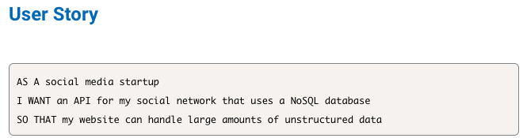
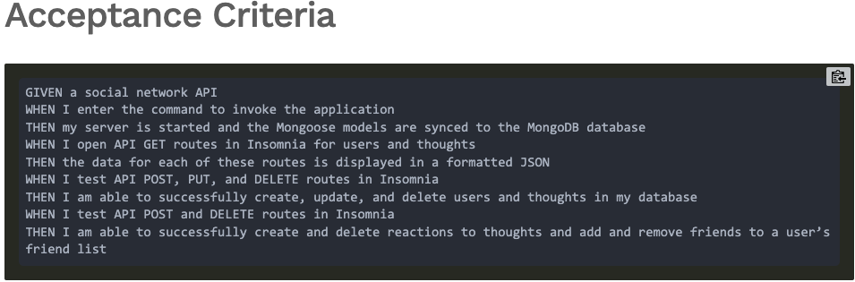

# Social Network API

# Table of Contents 
* [Description](#description) 
* [Installation](#installation)
* [License](#license)
* [Contributing](#contributing)
* [Questions](#questions)
        
## Description 
Your challenge is to build an API for a social network web application where users can share their thoughts, react to friends’ thoughts, and create a friend list. You’ll use Express.js for routing, a MongoDB database, and the Mongoose ODM. In addition to using the Express.js

## Mock-Up

### User Story 

### Acceptance Criteria 

## Walkthrough 
<iframe src="https://drive.google.com/file/d/1zrHqnVYQwnl957N1oOgftZMymtRaFybG/preview" width="640" height="480"></iframe>

## Installation
to use this application one must install 
* express
* mongoose

## License 
MIT license 

## Contributing 
William Wright

## Questions
Reach out to me regarding question at,
    * Github: <a href="https://github.com/wrightw404">wrightw404</a>
    * Email: <a href="mailto:Wrightw404@gmail.com">Wrightw404@gmail.com</a>